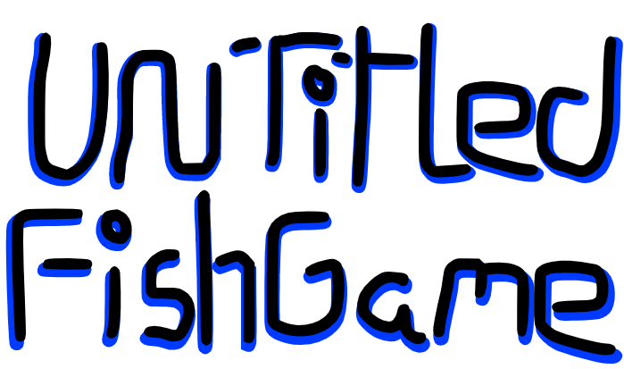

 
A game about fish that I'm making for my friend.  
Made using plain js and a slightly modifed eSharp beta (currently) 
Now renders better on Safari 
## Latest addition
Difficulty Curve added 

  
idk

  

  
idk

    

  
idk

      

  
idk

        

  
idk

          

  
idk

            

  
idk

              <ul><li>Idk</li></ul>

 
<b>Made by, ClassicMC</b>

